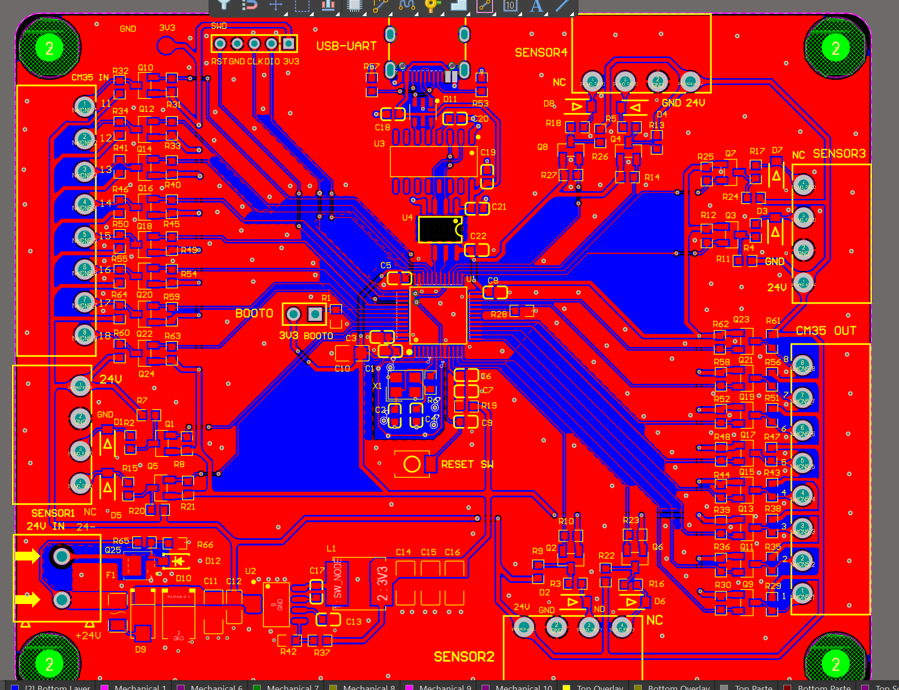
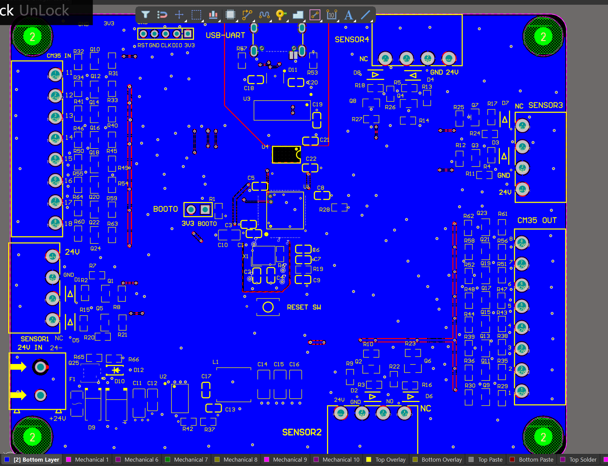
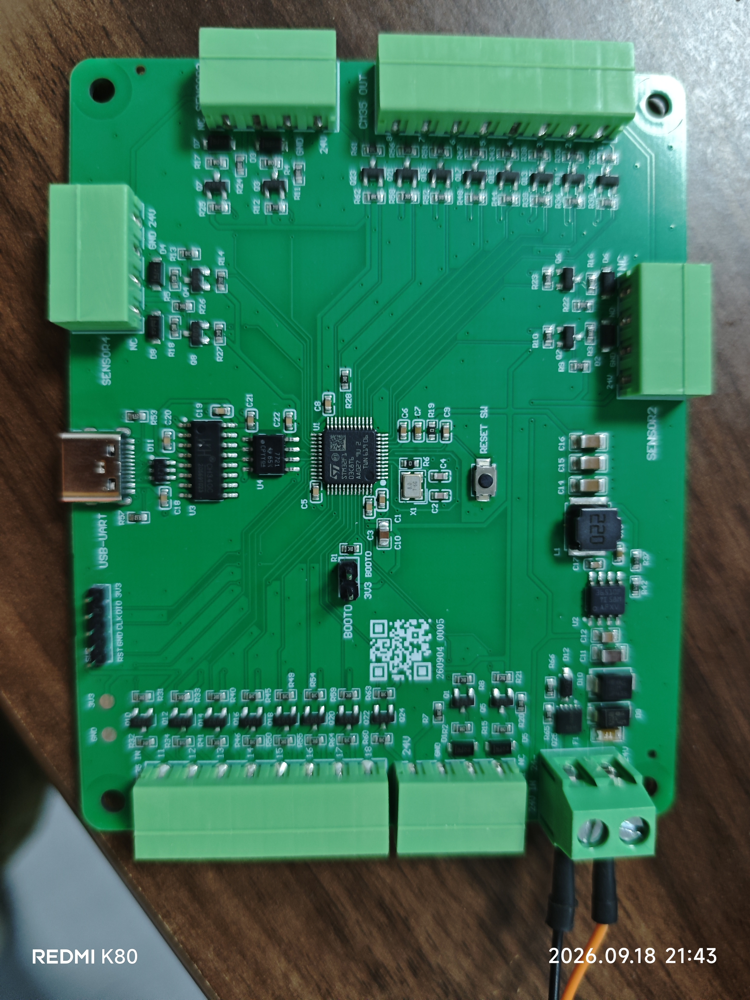

# STM32 24V Industrial I/O Bridge

Project Identity: wum747349-debug/STM32-24V-Industrial-IO-Bridge

Hardware Revision: Rev.C

Hardware Status: Fabricated / PCBA Assembled / Basic Functional Bring-up Completed / In Practical Use

Current Project Stage: Stage 6 — Routing and Copper

面向 24 V 工业现场的 STM32 I/O interface / bridge board，连接 PC、板载隔离 USB-UART、STM32、CM35 运动控制器和 4 路 AN-LS18-40-N 光电开关。Rev.C 将 STM32 最小系统、USB-C 通信、数字隔离、现场 I/O 和 24 V 电源保护集成在一块 100 mm × 80 mm PCB 上。

```text
24 V Industrial Power
        |
        v
Input Protection / 24 V -> 3.3 V
        |
        v
      STM32
        |-- Isolated USB-UART (USB-C / CH340C / ISO7721)
        |-- CM35 Motion-controller I/O
        `-- Photoelectric Sensor Interfaces (NO / NC)
```

## Hardware Gallery

| PCB Top | PCB Bottom |
| --- | --- |
|  |  |



## Engineering Highlights

- 24 V industrial input with reverse-polarity and input protection, plus onboard 24 V → 3.3 V conversion
- Onboard STM32F103C8T6 minimum system with SWD, reset, BOOT0, HSE, and accessible 3V3/GND test points
- USB-C + CH340C USB-UART with ISO7721 digital isolation and separated USB-side / machine-side ground domains
- Eight CM35 control outputs and eight CM35 status inputs for 24 V industrial I/O
- Four photoelectric-sensor interfaces with field-side power and NO / NC signal paths
- Two-layer PCB layout, signal/power routing, copper pours, isolation corridor, mask normalization, and production-oriented silkscreen
- JLCPCB fabrication / top-side PCBA workflow, followed by board bring-up and practical functional debugging

## Rev.C Hardware Evolution

Rev.C is the third hardware iteration and the current physical implementation. Compared with the previous revision, it:

- adds photoelectric-sensor field power and NO / NC signal interfaces;
- adds onboard USB-C and CH340C USB-UART communication;
- adds ISO7721 isolation between USB-side and machine-side domains;
- replaces the external STM32 minimum-system module with an onboard STM32 minimum system; and
- adds or improves 24 V reverse-polarity, input, and onboard power-conversion protection boundaries.

Detailed revision scope and evidence limits are recorded in [Hardware Revision History](docs/revision_history.md).

## Bring-up and Validation Status

### Confirmed

- Rev.C PCB and assembled PCBA exist and are represented by the images above.
- Basic 24 V power-on and board-level 3.3 V checking were completed.
- STM32 programming through ST-Link was completed.
- Host UART communication was completed at the basic functional-debug level.
- Industrial I/O basic control and terminal-voltage behavior were debugged.
- The board is currently in practical use.

### Not formally documented or claimed

- Complete channel-by-channel quantitative testing
- Quantified input current, startup waveform, ripple, or full-load characterization
- Abnormal-supply qualification
- EMC or surge PASS
- Isolation-withstand PASS
- Complete system acceptance PASS
- Production qualification or product certification

Rev.C has completed practical functional bring-up and is currently in use. Formal quantified validation remains bounded to the evidence documented in this repository; EMC/surge, isolation withstand, full electrical characterization, and complete system acceptance are not claimed. See the [Bring-up Record](docs/bringup_log.md) for the actual sequence, known results, limitations, and recommended future test plan.

## Engineering Status and Evidence Boundaries

- Requirements, component selection, module design, and formal schematic review records are retained in the repository. Stage 4 Formal Schematic Review is recorded as `PASS / CLOSED`, but the project does not claim full-board ERC PASS.
- Full-board placement was closed against the 100 mm × 80 mm mechanical baseline. Stage 6 signal/power routing, polygons, isolation corridor, and finalization work reached final-review level; the lifecycle stage remains **Stage 6 — Routing and Copper**.
- Final DRC on 2026-09-04 reported **0 warnings / 76 rule violations**. The remaining violations were classified as 4 intentional M3 NPTH/keepout scope collisions, 66 minimum solder-mask slivers, and 6 intentional HSE GND-guard net antennae.
- **Final DRC was not zero-violation.** The remaining findings were categorized and reviewed, but this repository does not declare a formal `DRC PASS`.
- JLCPCB production artwork and the PCB/PCBA order were released in September 2026. That historical release state does not replace current hardware-test evidence.
- A minor mechanical note remains for confirming the CN5 / lower-right M3 fastener and removable-terminal envelope with 3D, courtyard, or physical mechanical evidence.

## Repository Navigation

| Area | Record |
| --- | --- |
| Requirements | [requirements.md](requirements.md) |
| Block Diagram | [block_diagram.md](block_diagram.md) |
| Design Notes | [design_notes.md](design_notes.md) |
| Reference Index | [references.md](references.md) |
| Component Selection | [docs/component_selection_plan.md](docs/component_selection_plan.md) |
| Module Design | [docs/module_design/](docs/module_design/) |
| Schematic Review | [docs/schematic_review.md](docs/schematic_review.md) |
| PCB Design Rules | [docs/pcb_design_rules.md](docs/pcb_design_rules.md) |
| PCB Review / DRC / Manufacturing Record | [docs/pcb_review.md](docs/pcb_review.md) |
| Bring-up | [docs/bringup_log.md](docs/bringup_log.md) |
| Revision History | [docs/revision_history.md](docs/revision_history.md) |
| Hardware Sources and Evidence | [hardware/README.md](hardware/README.md) |
| Altium Source Project | [hardware/altium_project/](hardware/altium_project/) |
| Schematic PDF | [hardware/outputs/SCH_Schematic1_2026-09-01.pdf](hardware/outputs/SCH_Schematic1_2026-09-01.pdf) |
| BOM | [hardware/outputs/BOM_Board1_Schematic1_2026-09-01.xlsx](hardware/outputs/BOM_Board1_Schematic1_2026-09-01.xlsx) |
| Framework Binding | [FRAMEWORK.md](FRAMEWORK.md) |
| Project Rules | [PROJECT_RULES.md](PROJECT_RULES.md) |
| Project Validator | [scripts/validate_project_repository.py](scripts/validate_project_repository.py) |

## Current Source and Evidence Set

The current Rev.C Altium project source is versioned under `hardware/altium_project/`. The project file, schematic, PCB, and required project-local libraries are included; generated History, logs, previews, project outputs, manufacturing archives, and temporary files are excluded.

The current Stage 4 schematic PDF and BOM remain under `hardware/outputs/`. Images are presentation and physical-hardware evidence; they do not independently prove connectivity, ERC/DRC status, isolation rating, or quantified electrical performance.

## Next Evidence Work

Future work can add traceable, quantified power measurements, USB-UART power-sequence checks, complete industrial-I/O and sensor channel records, and a formal test report with explicit limits. This portfolio finalization does not perform a Stage transition or convert recommended tests into completed results.
